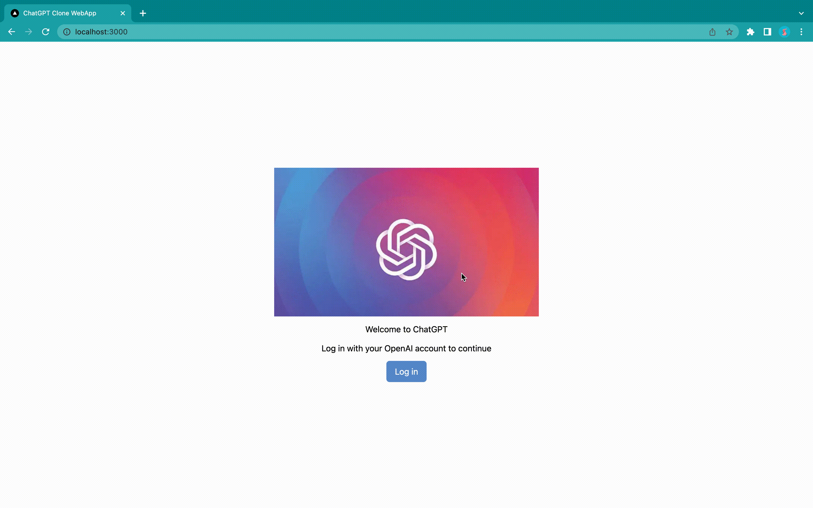
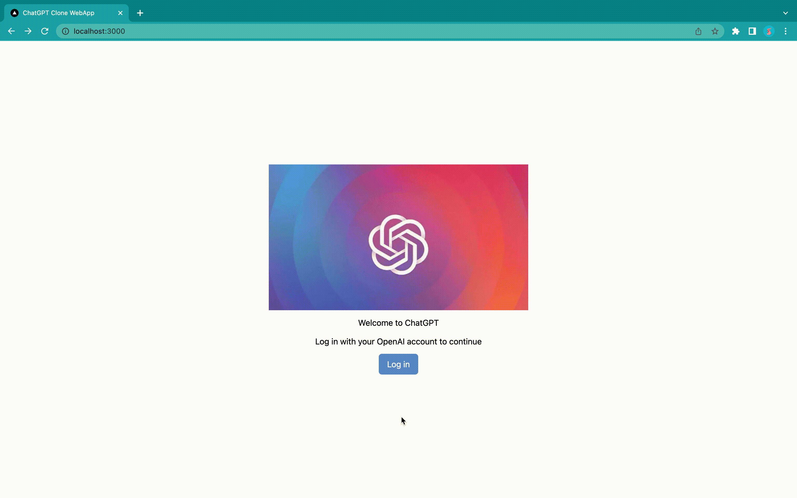
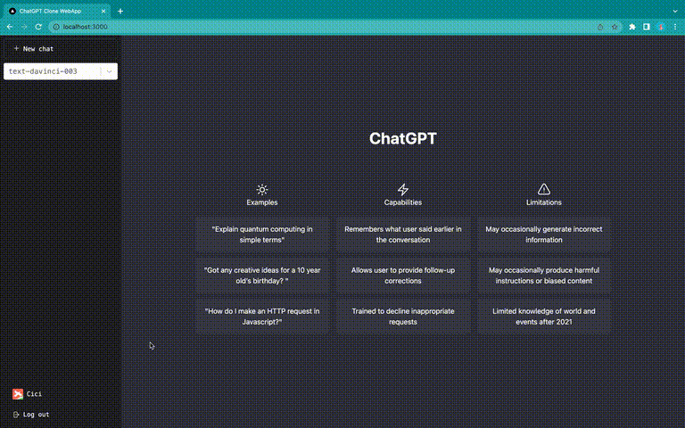
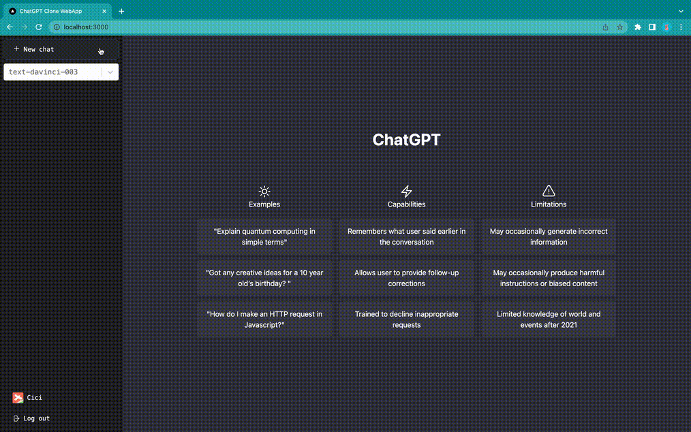
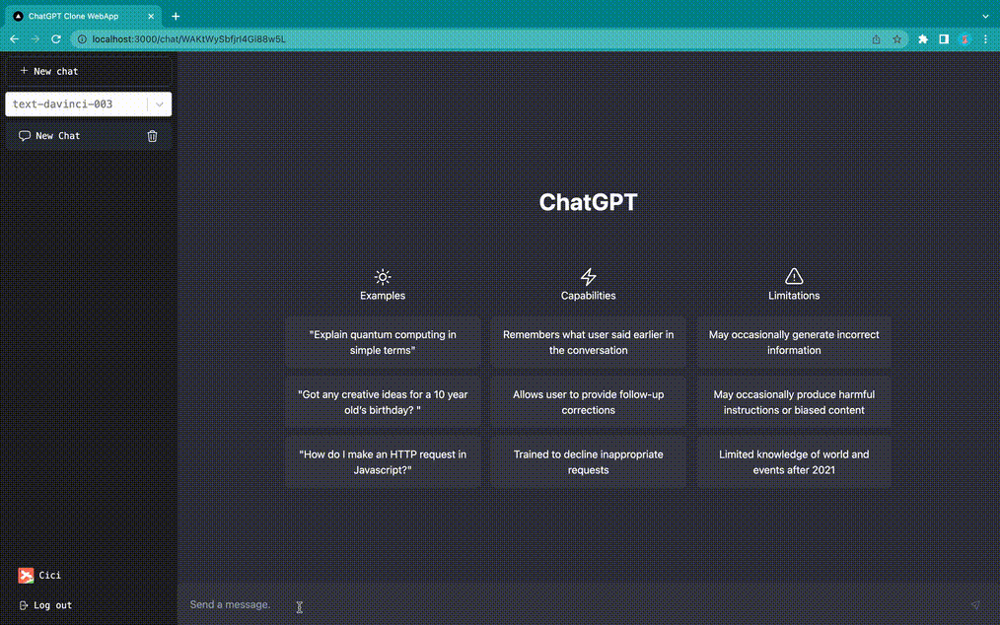

<div align="left">

  <h1>ChatGPT Clone Web App</h1>
  
<div align="center">
<a href="https://chatgpt-webapp-nv.vercel.app/" target="_blank"></a>
</div>

  <p>
The ChatGPT Clone is a web application that boasts a modern, responsive design and an advanced AI chatbot powered by OpenAI API and developed using TypeScript, React, and Tailwind CSS. It leverages Firebase V9 to enable secure, real-time chat functionality through API endpoints within the Next.js framework. To optimize data fetching, useSWR was implemented, while NextAuth for Firebase Google Authentication was used to ensure secure user access. Finally, the app was deployed on Vercel, providing high performance and scalability for its users.
  </p>
  
### <a href="https://chatgpt-webapp-nv.vercel.app/" target="_blank">LIVE DEMO 🔗</a>
<br />


<!-- Table of contents -->
## Table of Contents

- [About the Project](#star2-about-the-project)
  - [Tech Stack](#tech-stack)
  - [Application Features](#application-features)
    - [Homepage](#homepage)
    - [Log In](#log-in)
    - [Log Out](#log-out)
    - [Create and Delete Chat](#create-and-delete-chat)
    - [Model Selection](#model-selection)
    - [Notification Toast](#notification-toast)
    - [Send Message and Get Respond](#send-message-and-get-respond)
- [Getting Started](#getting-started)
- [Useful Resource](#useful-resource)
- [Developer](#developer)
<br />


<!-- Tech Stack -->
## Tech Stack
### Languages:


### Frameworks, Platforms and Libraries:


### Cloud Hosting/SaaS:


### Databases:


[(Back to top)](#table-of-contents)

<br />


<!-- Application Features -->
## Application Features

### Homepage

  
[(Back to top)](#table-of-contents)
  
### Log In 

  
[(Back to top)](#table-of-contents)
  
### Log Out

  
[(Back to top)](#table-of-contents)
  
### Create and Delete Chat

  
[(Back to top)](#table-of-contents)
  
### Model Selection

  
[(Back to top)](#table-of-contents)
  
### Notification Toast

  
[(Back to top)](#table-of-contents)
  
### Send Message and Get Respond

  
[(Back to top)](#table-of-contents)


<br />

<!-- Getting Started -->
## Getting Started
Start the server
First, run the development server:

```bash
  npm run dev
```

This is a [Next.js](https://nextjs.org/) project bootstrapped with [`create-next-app`](https://github.com/vercel/next.js/tree/canary/packages/create-next-app).

Install dependencies
This is a [Next.js](https://nextjs.org/) project bootstrapped with [`create-next-app`](https://github.com/vercel/next.js/tree/canary/packages/create-next-app).

Open [http://localhost:3000](http://localhost:3000) with your browser to see the result.

You can start editing the page by modifying `pages/index.js`. The page auto-updates as you edit the file.

[API routes](https://nextjs.org/docs/api-routes/introduction) can be accessed on [http://localhost:3000/api/hello](http://localhost:3000/api/hello). This endpoint can be edited in `pages/api/hello.js`.

The `pages/api` directory is mapped to `/api/*`. Files in this directory are treated as [API routes](https://nextjs.org/docs/api-routes/introduction) instead of React pages.

### Learn More

To learn more about Next.js, take a look at the following resources:

- [Next.js Documentation](https://nextjs.org/docs) - learn about Next.js features and API.
- [Learn Next.js](https://nextjs.org/learn) - an interactive Next.js tutorial.

You can check out [the Next.js GitHub repository](https://github.com/vercel/next.js/) - your feedback and contributions are welcome!

<!-- Deployment -->

### Deployment

To deploy this project run

##### Deploy on Vercel

The easiest way to deploy your Next.js app is to use the [Vercel Platform](https://vercel.com/new?utm_medium=default-template&filter=next.js&utm_source=create-next-app&utm_campaign=create-next-app-readme) from the creators of Next.js.

Check out our [Next.js deployment documentation](https://nextjs.org/docs/deployment) for more details.
  
  
### Install dependencies
https://github.com/YingluDeng/chatgpt_webapp_v1.0/blob/main/package.json
  
### Install tailwind css with next.js
```java
npx create-next-app -e with-tailwindcss [proj_name]
```
  
### Local Environment Variables for .env.local
```java
GOOGLE_ID 
GOOGLE_SECRET 
OPENAI_API_KEY 
FIREBASE_SERVICE_ACCOUNT_KEY
```

[(Back to top)](#table-of-contents)

<br />
  

<!-- Useful Resource -->
## Useful Resource
### Frontend:
<a href="https://flexboxfroggy.com/" target="_blank">🔗 Flexbox: A game for learning CSS flexbox. </a> <br/>
<a href="https://heroicons.com/" target="_blank">🔗 Icon: Beautiful hand-crafted SVG icons, by the makers of Tailwind CSS. </a> <br/> 
<a href="https://ui-avatars.com/" target="_blank">🔗 Avatar: Generate avatars with initials from names.</a> <br/>
<a href="https://react-hot-toast.com/" target="_blank">🔗 Notification: Add beautiful notifications to your React app with react-hot-toast.</a> <br/>
<a href="https://textfixer.com/" target="_blank">🔗 Text tool: Remove line breaks online tool.</a> <br/>
<a href="https://react-select.com/" target="_blank">🔗 Selection Box: A flexible and beautiful Select Input control for ReactJS with multiselect, autocomplete, async and creatable support.</a>
  
### Backend:
<a href="https://next-auth.com/" target="_blank">🔗 Authentication: NextAuth.js is a complete open-source authentication solution for Next.js applications.</a> <br/>
<a href="https://firebase.google.com/docs/database" target="_blank">🔗 Real-time Database: The Firebase Realtime Database is a cloud-hosted database. Data is stored as JSON and synchronized in realtime to every connected client.</a> <br/>
<a href="https://firebaseopensource.com/projects/csfrequency/react-firebase-hooks/" target="_blank">🔗 React Firebase Hooks: A set of reusable React Hooks for Firebase..</a> <br/>
<a href="https://swr.vercel.app/" target="_blank">🔗 useSWR: React Hooks for Data Fetching.</a> <br/>
<a href="https://vercel.com/docs/cli" target="_blank">🔗 Vercel CLI: Manage and configure your Vercel Projects from the command line.</a> <br/>
  
[(Back to top)](#table-of-contents)

<br />


  
<!-- Developer -->
## Developer
**Cecilia Deng** - https://www.linkedin.com/in/yinglu-cecilia-deng/<br/>
**Project link** - https://chatgpt-webapp-nv.vercel.app/

  
<br />
  
[(Back to top)](#table-of-contents)

  
