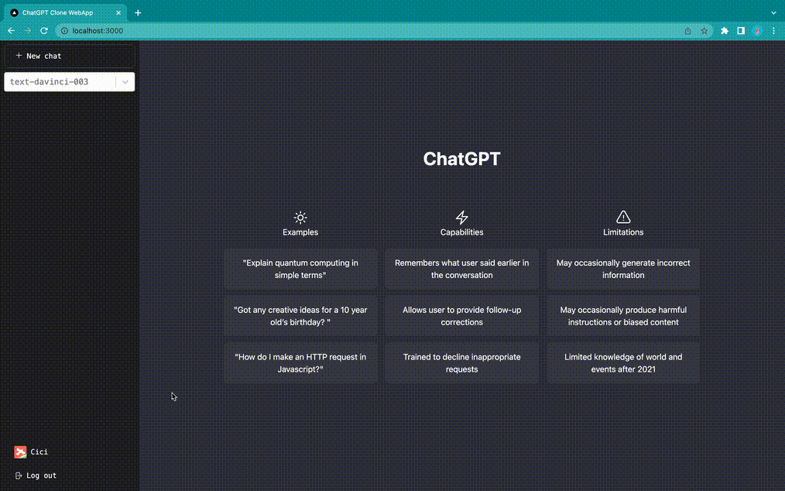

  <h1>ChatGPT Clone Web App</h1>
  

  

The ChatGPT Clone is a web application that boasts a modern, responsive design and an advanced AI chatbot powered by OpenAI API and developed using TypeScript, React, and Tailwind CSS. It leverages Firebase V9 to enable secure, real-time chat functionality through API endpoints within the Next.js framework. To optimize data fetching, useSWR was implemented, while NextAuth for Firebase Google Authentication was used to ensure secure user access. Finally, the app was deployed on Vercel, providing high performance and scalability for its users.
  

  
### <a href="https://chatgpt-webapp-nv.vercel.app/" target="_blank">LIVE DEMO 🔗</a>
 

<!-- Table of contents -->
## Table of Contents

- [About the Project](#star2-about-the-project)
  - [Tech Stack](#tech-stack)
  - [Application Features](#application-features)
    - [Homepage](#homepage)
    - [Log In](#log-in)
    - [Log Out](#log-out)
    - [Create and Delete Chat](#create-and-delete-chat)
    - [Model Selection](#model-selection)
    - [Notification Toast](#notification-toast)
    - [Send Message and Get Respond](#send-message-and-get-respond)
  - [Built Environment](#built-environment)
- [Getting Started](#getting-started)
- [Useful Resource](#useful-resource)
- [Developer](#developer)
 

<!-- Tech Stack -->
## Tech Stack
### Languages:

### Frameworks, Platforms and Libraries:

### Cloud Hosting/SaaS:

### Databases:

[(Back to top)](#table-of-contents)

 

<!-- Application Features -->
## Application Features

### Homepage

  
[(Back to top)](#table-of-contents)
  
### Log In 

  
[(Back to top)](#table-of-contents)
  
### Log Out

  
[(Back to top)](#table-of-contents)
  
### Create and Delete Chat

  
[(Back to top)](#table-of-contents)
  
### Model Selection

  
[(Back to top)](#table-of-contents)
  
### Notification Toast

  
[(Back to top)](#table-of-contents)
  
### Send Message and Get Respond

  
[(Back to top)](#table-of-contents)

 

<!-- Getting Started -->
## Getting Started

 

<!-- Useful Resource -->
## Useful Resource
  

### Frontend:
<a href="https://flexboxfroggy.com/" target="_blank">🔗 A game for learning CSS flexbox. </a>
  
<a href="https://heroicons.com/" target="_blank">🔗 Beautiful hand-crafted SVG icons, by the makers of Tailwind CSS. </a>
  
<a href="https://ui-avatars.com/" target="_blank">🔗 Generate avatars with initials from names.</a>
  
<a href="https://react-hot-toast.com/" target="_blank">🔗 Add beautiful notifications to your React app with react-hot-toast.</a>
  
<a href="https://textfixer.com/" target="_blank">🔗 Remove line breaks online tool.</a>
  
<a href="https://react-select.com/" target="_blank">🔗 A flexible and beautiful Select Input control for ReactJS with multiselect, autocomplete, async and creatable support.</a>
  
  
### Backend:

authentication - **NextAuth.js** [https://next-auth.js.org/](https://next-auth.js.org/)

real-time database - **firebase v9**

react firebase hooks (connect these two together)

[https://github.com/csfrequency/react-firebase-hooks/tree/09bf06b28c82b4c3c1beabb1b32a8007232ed045/firestore](https://github.com/csfrequency/react-firebase-hooks/tree/09bf06b28c82b4c3c1beabb1b32a8007232ed045/firestore)

[https://swr.vercel.app/](https://swr.vercel.app/)

[https://vercel.com/docs/cli](https://vercel.com/docs/cli)
  
 

  
<!-- Developer -->
## Developer
**Cecilia Deng** - https://www.linkedin.com/in/yinglu-cecilia-deng/ 
**Project link** - https://chatgpt-webapp-nv.vercel.app/

  
 
  
[(Back to top)](#table-of-contents)

  
